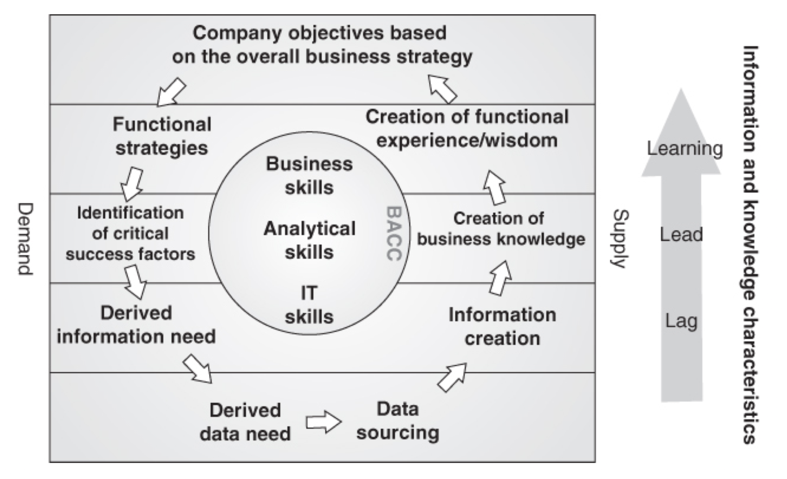

-   **Section 1** – Business Analytics Competency Center
    -   BACC
        -   Factors that limit successful creation and execution of
            business analytics
        -   Lack of competencies in all parts of the business
        -   Organizational structure prevents success
    -   Includes the following competencies
        -   Analytical
        -   Business
        -   IT
    -   What is it?
        -   A problem solving forum
        -   Maximize revenue flow from business analytics initiatives
        -   Create analytics processes rather than IT processes
        -   Ensures that business needs drive all technical initiatives
        -   Ensures that the business relizes the benefits of BA
        -   Ensures the necessary analytics competencies are present and
            accessible
-   **Section 2** – Why set up a BACC?
    -   Issues
        -   Want BA function to have more of an impact
        -   Analysts spread out in different departments
        -   No common forum to discuss issues
        -   Solutions only applicable locally in specific departments
    -   How can it help?
        -   A voice that can be heard throughout the organization
        -   Two ways this can happen
            -   Give the manager of the BACC formal influence on
                management forums
            -   Create synergies at the functional level
        -   Create an ongoing dialogue for the improvement of the
            business
        -   Solutions can be shared across departments and functions
-   **Section 3** – Tasks and Competencies
    -   The information wheel (see image below)
        -   The Information Wheel describes the process of providing
            analytics to the business
        -   Note that it is not always a cycle as shown, many projects
            finish with no follow up
        -   Shows that the BACC lies at the center of what is provided
        -   The BACC can be a dedicated team or can be decentralized
            (more on this later)
    -   Create learning
        -   The purpose of knowledge management is to have the best of
            both: a decentralized organization releasing its full
            creative potential while at the same time making sure that
            other decentralized units reuse the good ideas generated.
        -   How do we do it?
        -   Public document store
        -   Internal Wiki
        -   Knowledge Management System ( Digital solutions may lead to
            person-to-person interactions (and improve the knowledge
            stored in digital form)
    -   Technology benefits
        -   Could reduce software costs via standardization and reduced
            duplication
        -   A possible better negotiating position with vendors
        -   Reduced number of technologies results in smaller need for
            expertise in different software packages
        -   Reduces the number of projects needed to integrate different
            platforms
    -   Additional notes regarding technology
        -   The BACC does not design information architecture or
            technology strategies
        -   The BACC enters into a dialogue with system owners to ensure
            the information architecture and technology strategies
            support the organization’s information strategy
        -   The scope of the BA function should be dictated by the
            business, not by technological solutions
    -   Educating users
        -   The results of the information generation process will
            create some solution (often a report or dashboard).
        -   The following are true:
            -   The solution is never better than its users
            -   A successful implementation requires three elements
                -   User friendliness
                -   Relevant information
                -   General support
    -   User Friendliness
        -   What
            -   The system/report must be inviting, intuitive, and clear
        -   How
            -   Get feedback from users
            -   Typically needed before and after delivery
            -   Build in a period for feedback
    -   Relevance of Information
        -   What
            -   Information must be available, accurate, and actionable
        -   How
            -   Requires a front-end system that can provide information
                at the speed necessary
            -   Need to validate data both internally and externally
            -   Right data to the right people at the right time in a
                way they can use it
    -   General Support
        -   What
            -   Users should be trained, there should be a way to get
                answers to questions and submit feedback
        -   How
            -   Training sessions
            -   Remote training sessions
            -   Video content that can be referred to when needed
                (knowledge management system)

